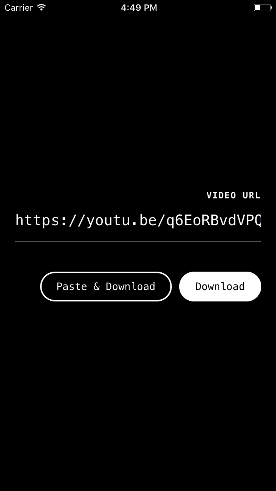

# rolldown

A simple React Native app that downloads videos to your camera roll.



## Supported services

- [x] Direct `.mp4` and `.mov` videos.
- [x] Youtube
- [x] Twitter
- [x] Instagram
- [x] Facebook
- [x] Tumblr
- [x] etc.
- [ ] Vine

## Setup

1. **Clone the repo**

  ```
  $ git clone https://github.com/fabe/rolldown.git
  $ cd rolldown
  ```

2. **Install dependencies**

  ```
  $ npm install
  ```

3. **Running on iOS**

  ```
  $ react-native run-ios
  ```
